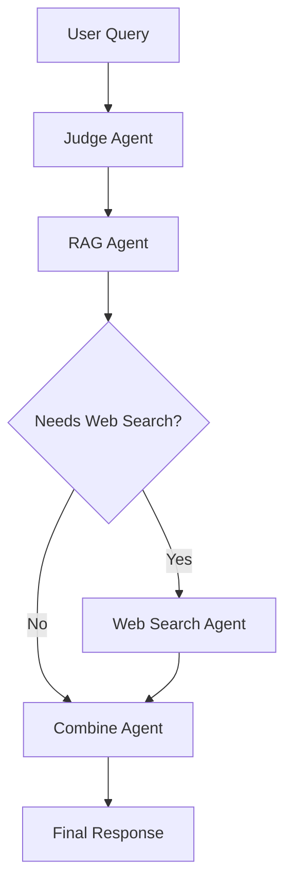

# 🏗️ System Architecture

This document provides a high-level overview of the technical architecture driving the Korean Law Expert Bot.

## 🤖 Agentic Framework (LangGraph)

The bot has transitioned from a monolithic request-response model to a state-aware agentic graph using **LangGraph**. This allows for complex, multi-step reasoning.

### Workflow Nodes
1. **Judge Agent**: Analyzes the user's query to determine routing.
2. **RAG Agent**: Retrieves relevant legal provisions from the local vector database.
3. **Web Search Agent**: (Conditional) Uses Tavily to fetch recent news or updates if the query requires external context.
4. **Combine Agent**: Merges local legal data with web results and history into a cohesive response.

## 📚 Retrieval-Augmented Generation (RAG)

Our RAG system is optimized for the structural nuances of Korean legal code.

### 1. Context-Aware Splitting
Instead of fixed-character chunking, we use an LLM-assisted **Legal Context-Aware Splitter**.
- **Structural Integrity**: Prioritizes splitting at Article (`제N조`) or Paragraph boundaries.
- **Semantic Continuity**: Assesses "context breaks" to ensure a chunk contains a complete legal thought.
- **Dynamic Sizing**: Adjusts chunk size based on text complexity.

### 2. Embedding & Vector Store
- **Embedding Model**: `KR-SBERT` (optimized for Korean semantic similarity).
- **Vector Database**: **ChromaDB**, configured with specialized retrievers:
  - **Question Retriever**: High focus (Low lambda) for matching specific legal keywords.
  - **Answer/Inspect Retrievers**: High diversity (MMR) for broad legal context.

## 💾 Persistence Layer
- **MongoDB**: Stores conversation history and user session data.
- **Chroma Storage**: Locally persisted vector database in the `db/` directory.

## 🛠️ Tech Stack
- **Language**: Python 3.11
- **LLM Orchestration**: LangChain, LangGraph
- **LLM Provider**: Ollama (Local) or Google Gemini (Cloud)
- **Database**: MongoDB & ChromaDB
- **Messaging**: Telegram Bot API (via `python-telegram-bot`)
